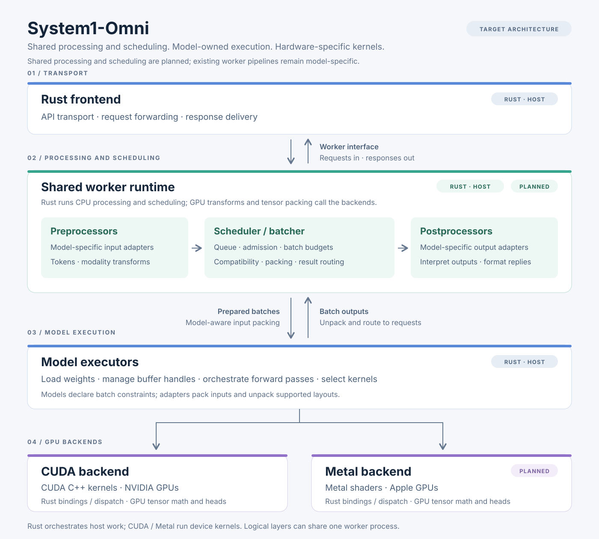

<h1 align="center">
  <picture>
    <source media="(prefers-color-scheme: dark)" srcset="docs/assets/logos/system1-omni-dark.png">
    
  </picture>
</h1>

  
  
  
  

  <strong>Fast decision-model serving for agents.</strong>

  <a href="#how-it-works">How It Works</a> ·
  <a href="https://thinkflowlab.github.io/system1-omni/docs/getting-started/">First Decision</a> ·
  <a href="https://thinkflowlab.github.io/system1-omni/recipe/laya/validation/#decision-demo">Demo</a> ·
  <a href="https://thinkflowlab.github.io/system1-omni/docs/supported-models/">Supported Models</a> ·
  <a href="https://thinkflowlab.github.io/system1-omni/docs/getting-started.zh/">中文</a> ·
  <a href="https://thinkflowlab.github.io/system1-omni/">Documentation</a> ·
  <a href="#benchmarks">Benchmarks</a> ·
  <a href="#roadmap">Roadmap</a> ·
  <a href="#contributing">Contributing</a>

## About

**System1-Omni** serves decision models for agents: route a support ticket to
billing, score its urgency, or decide whether it asks for a refund. Models return
structured decisions from a prefill pass. Start with the
[complete CPU walkthrough](docs/getting-started.md), inspect the
[real request and response](recipe/laya/validation.md#decision-demo), and check
the [model and hardware matrix](docs/supported-models.md).

The community-maintained engine combines a Rust frontend with model-owned
execution and CUDA backends. The target architecture separates processing and
scheduling from model execution; a native Metal backend is planned, while LAYA
already has a Python worker for Apple GPUs through PyTorch MPS.

The Rust frontend forwards requests to a separately running model worker. The
Cua-S1 4B 0.2 `text` adapter and Open-Jev-27B-v1.1 have native workers using
shared CUDA kernels in this repository.

## News

- **2026-10-03:** Added [Open-Jev-27B-v1.1](recipe/open_jev/native.md)
  support through a native Rust/CUDA worker: **7.47× faster than raw HF Transformers**
  by mean warm HTTP latency, **362.21→48.50 ms** on one H200. Measured over
  74 single-candidate JevBench `noul` requests per pass, with two measured passes
  per backend (BF16, concurrency 1). See the
  [HF Transformers baseline, results and OpenJev-Fast comparison](recipe/open_jev/validation.md).

## Features

- **Rust serving frontend.** API, request lifecycle, and response delivery
  through a small engine interface, forwarding requests to separately running
  model workers.
- **Model-owned execution.** Model executors own weights, forward passes,
  learned heads, device state, and kernel selection. Native workers have separate
  processing and executor modules, with shared FIFO admission and blocking
  dispatch in the [native runtime](src/runtime/README.md).
- **Native CUDA workers.** The Cua-S1 4B 0.2 `text` adapter and
  Open-Jev-27B-v1.1 run as native workers with shared CUDA kernels. Cua-S1
  also has a Python worker that serves as the correctness reference.
- **LAYA text serving.** LAYA runs as an external CPU Python worker, the
  in-repository Python MPS/CPU worker, or a native Rust/CUDA worker on Hopper.
- **CUDA backend and planned Metal backend.** High-performance GPU operations
  for NVIDIA GPUs, with a native Apple-GPU backend planned alongside it.
- **Benchmark harness.** Request replay, output-fidelity checks, and a CUDA
  comparison protocol across serving backends.

## How It Works

Share processing and scheduling; let each model own its execution.

The diagram shows the **target architecture**. Today the frontend forwards HTTP
requests to separately running workers, whose handlers coordinate independent
processors and executors. Native workers use shared FIFO admission and
blocking dispatch per loaded executor. Processing orchestration, batch budgets,
compatibility grouping and dynamic batching remain planned.

| Layer | Responsibility | Native target implementation |
| --- | --- | --- |
| Rust frontend | API transport, request forwarding, and response delivery. | Rust. |
| Processing layer | Independent pre/postprocessing modules with model-specific processors for input preparation and output interpretation. | Rust CPU processing; GPU transforms use backends. |
| Scheduler / batcher | Queue admission, batch budgets, compatibility grouping, batch assembly, request bookkeeping, and result routing. | Rust host policy; GPU packing uses backends. |
| Model executors | Weights, forward passes, learned heads, device state, and kernel selection. | Rust orchestration calling backend operations. |
| CUDA backend | High-performance GPU operations for NVIDIA GPUs. | Rust bindings/dispatch and CUDA C++ kernels. |
| Metal backend (planned) | High-performance GPU operations for Apple GPUs. | Rust bindings/dispatch and Metal shaders. |

In the target design, the shared worker runtime invokes processors, schedules
compatible work, calls the model executor, and routes each output back to its
request. Tokenization, modality transforms, and response interpretation remain
model-specific plugins, separate from the forward implementation. Models
declare batch constraints; batch adapters pack inputs and unpack outputs using
the executor's supported layout. A shared scheduler must not batch incompatible
models or inputs, and dynamic batching requires executor support for real batches.

These are logical layers: the runtime and executor can share a worker process.
Request bookkeeping belongs to the runtime; model device state belongs to the
executor. Backends can optimize for their hardware without requiring identical
internal implementations.

The [architecture and integration contracts](docs/architecture.md) define
processor/executor boundaries, compatibility grouping, state and buffer
lifetimes, and result reconstruction. They also distinguish the native target
from current single-prompt execution and CPU decision heads.

## Repository Layout

Implementation code lives under `src/`; recipes and documentation stay at the
repository root.

| Directory | Responsibility |
| --- | --- |
| [`src/frontend/`](src/frontend/) | Rust serving code, Python worker adapters, and the small engine interface. |
| [`src/runtime/`](src/runtime/README.md) | Shared native execution admission and blocking dispatch. |
| [`src/models/`](src/models/) | Model contracts, existing worker pipelines, and model executors, including the shared Qwen3.5/3.8 prefill implementation. |
| [`src/backends/cuda/`](src/backends/cuda/) | NVIDIA GPU operations and kernel integration. |
| [`src/backends/metal/`](src/backends/metal/) | Apple GPU operations and kernel integration. |
| [`recipe/`](recipe/) | Model setup instructions, launch commands, configuration examples, and example requests. |
| [`docs/`](docs/) | Project documentation and architecture assets. |

The frontend, native runtime, the native workers, their shared Qwen3.5/3.8
prefill implementation and the Laya CUDA backend are Cargo workspace members.
The other model and backend directories currently document planned work;
they do not prescribe process boundaries.

## Getting Started

Follow [Your first decision on CPU](docs/getting-started.md)
([中文入口](docs/getting-started.zh.md)) for prerequisites, pinned dependencies,
worker and frontend startup, readiness checks, a refund request and expected output.
The recommended path uses the upstream LAYA English worker on Linux x86_64 with
Python 3.12 and stable Rust; it needs no GPU or weight export.

The [recorded CPU demo](recipe/laya/validation.md#decision-demo) includes the
actual JSON and checks for `choice`, `score` and `noul`. Download/build/loading
time is separate from inference; no setup-duration or CPU speed claim is made.
For other hardware, see the [LAYA MPS recipe](recipe/laya/apple-silicon.md) or
the accelerated [native Open-Jev recipe](recipe/open_jev/native.md).
The [frontend documentation](src/frontend/README.md) describes transport and configuration.

## Supported Models

LAYA text serving uses the upstream CPU worker, the in-repository Python MPS/CPU
worker, or a native Rust/CUDA worker on Hopper. The Cua-S1 4B 0.2 `text` adapter
runs as a Python worker or as a native worker on CUDA. Open-Jev-27B-v1.1
runs as a native Rust/CUDA worker. Cua-S1 also has a Python screenshot worker,
and CLM has a stub-encoder contract recipe:

| Model | Status |
| --- | --- |
| LAYA | [External worker](recipe/laya/README.md); [Python worker on Apple Silicon (MPS) and CPU](recipe/laya/apple-silicon.md); [CPU checkpoint reader](src/models/laya/README.md); [native Rust/CUDA worker on Hopper](recipe/laya/native/README.md) |
| Cua-S1 4B 0.2 (`text` adapter) | [Python worker](recipe/cua_s1/text.md); [native worker](recipe/cua_s1/native.md), CUDA, run on sm_89 |
| Cua-S1 4B 0.2 (`multimodal` adapter) | [Python CUDA worker](src/frontend/cua_s1.py); one PNG/JPEG screenshot, `choice`; native screenshot execution remains in progress |
| Open-Jev-27B-v1.1 | [Native Rust/CUDA worker](recipe/open_jev/native.md); eager independent text candidates; [H200 validation](recipe/open_jev/validation.md) |
| Valen-Preview-0923 | [Python reference worker](recipe/valen/reference.md); text state or one inline PNG/JPEG image, `choice`; BF16 CUDA image path validated on RTX 5060 Laptop GPU |
| CLM-v0.1-8B | [External worker with a CPU stub encoder](recipe/clm/README.md); contract checks only, real Qwen3-8B decisions unverified by this recipe |

[Supported models and hardware](docs/supported-models.md) lists the devices
and where each worker has been run.

## Benchmarks

See the [GPU serving benchmark](benchmarks/README.md) for request replay,
output-fidelity checks, and the CUDA comparison protocol. The
[Open-Jev H200 results](recipe/open_jev/validation.md) cover 74 single-candidate
requests and a matched comparison with raw HF Transformers and OpenJev-Fast.
The [Open-Jev optimization notes](docs/blog/2026-10-05-open-jev-optimization.md)
record PR-by-PR Rust/CUDA changes and isolated A/B measurements, with figures,
numerical checks and links to the separate experiments.

## Roadmap

The current focus is the native Cua-S1 and Open-Jev CUDA workers and the serving
benchmark harness. Planned work extends the shared runtime with processing
orchestration, admission budgets, compatibility grouping and bounded dynamic
batching with batch-capable executors,
additional model engines and GPU backends
including Metal, and per-model
performance measurements as implementations are added and validated.

## 🤝 Contributing

System1-Omni is open to contributions across serving, models, backends,
benchmarks, and documentation. A reproducible bug report, a carefully measured
benchmark, or a clearer recipe can be just as useful as a kernel optimization.

Review the [contributing guide](CONTRIBUTING.md) before opening a pull
request: self-review the full diff, keep serving, processing, scheduling, and
model execution separate according to the [architecture contracts](docs/architecture.md),
and run the checks appropriate to your changes.

**Have an idea or found a problem?** [Open an
issue](https://github.com/ThinkFlowLab/system1-omni/issues/new) with the
details, or [send a pull
request](https://github.com/ThinkFlowLab/system1-omni/compare). For larger
changes, start a discussion in an issue so we can work through the design
together.

## Stay Tuned with Us

If you find system1-omni useful, [give us a star on GitHub](https://github.com/ThinkFlowLab/system1-omni)
to support the project and help others discover it!

